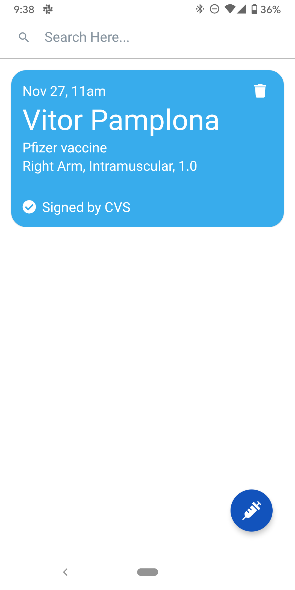

# Signed Health Passport Reader



App to import Vaccine/Test Paper QR Certificates using the [PathCheck's Paper Credential Specifications](https://github.com/Path-Check/paper-cred). 

This app allows any venue to track the health status of people participating in activities or entering in certain spaces. 

## Behavior

1. Vaccine provider emits a Certificate of Vaccination ([here](https://github.com/vitorpamplona/vaccine-certificate-qrcode-generator)) that is Signed by the Provider (impossible to forge)
2. The app reads the QR Code, validates the signature and imports multiple certificates for the user and other vacinees.
3. All certificates are showed as cards on the main home page.  

## Download the latest release

You will find the latest APK on our release files [here](https://github.com/vitorpamplona/vaccine-certificate-tracking-app/releases)

## Certificate Specification

The certificate is the signed record that prove a patient name has taken a vaccine. It follows the format of [paper-creds](https://github.com/Path-Check/paper-cred): 

```
cred:type:version:signature:publicKeyId:payload
```

Example:

```
CRED:BADGE:1:GBCAEIBOFEBIZUXYC2D6EYOBJURKOQ5KQ3F4YLAUBMO3MY52E6QSVNMIAQBCAOTWMM5VZTWW3USVQLNCNNNAGXJ4PW3JYKL6TWMKZXDJA5E2CPPC:PCF.VITORPAMPLONA.COM:20210303/MODERNA/COVID-19/012L20A/28/TCXRTFWS4NAADDA5N76GOUIYUP54BCY5DLYUVU2YIISKVKNTR7VA/C28161/RA/500
```

## Features / TO-DO List

- [x] QR Certificate Scanner (v0.0.1)
- [x] Signature Validation (v0.0.2)
- [x] Local Storage (v0.0.5)
- [x] Card Layout UI (v0.0.6)
- [x] Automated Release Management from GitHub Actions (v0.0.6)
- [x] Search on header (v0.0.8)
- [x] Sort by Scan Date (v0.0.9)
- [x] Delete Cards (v0.0.9)
- [x] Dark and Light Modes (v0.0.13)
- [x] Downloading public key from vaccinator URL (v0.0.14)
- [x] Percent-encoding and Base64 for signatures (v0.0.14)
- [ ] Reduce amount of data on QRCodes
- [ ] New Layout Grouped by Day and then by Person
- [ ] New UI from [here](https://www.figma.com/file/eFzXoLzyk489j864bEJiJL/PathCheck-Health-Passport?node-id=51%3A0)
- [ ] New App Icon

# Development Overview

This is a React Native app version >61.5

## Requirements

- Git
- NVM
- Node (10.1 or newer)
- Yarn
- Watchman
- OpenJDK (for Android building and installing)
- Android Studio (SDK, AVD)
- CocoaPods (Required for installing iOS dependencies)
- XCode (for iOS Dev)
- ios-deploy (installing your app on a physical device with the CLI)

## Running

Install modules:
`yarn install`

To run, do:

**For iOS**

```
npm install
cd pod/
pod install
cd ..
npx react-native run-ios 
```

**For Android**

```
npm install
npx react-native run-android
```

## Generating new Version

GitHub Actions generates a new [Release](https://github.com/vitorpamplona/vaccine-certificate-tracking-app/releases) when npm version is run and pushed to the repo.

```
npm version <version number: x.x.x>
```

## Contributing

[Issues](https://github.com/Path-Check/healthpassport-provider-reader-app/issues) and [pull requests](https://github.com/Path-Check/healthpassport-provider-reader-app/pulls) are very welcome! :)
